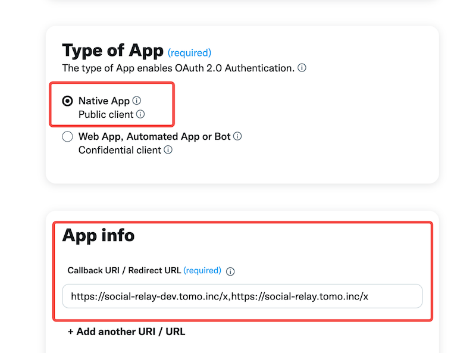
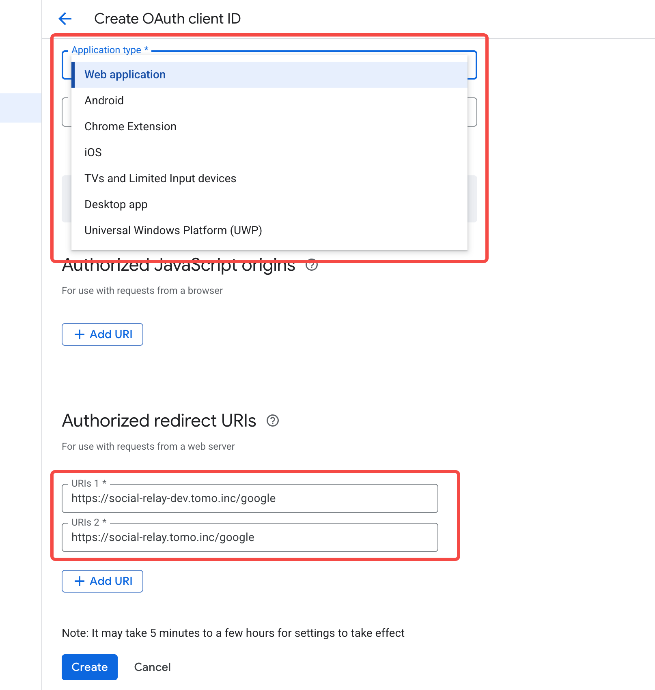

# Tomo Social WalletSDK Cookbook

Social login support

1.  x (twitter)
2.  google
3.  email

## 1. Install SDKs

```typescript
pnpm add @tomo-inc/social-account-sdk
```

evm recommend

```typescript
pnpm add viem
```

## 2. Config Prepare

### 2.1 Create X App



1.  **User authentication settings**: https://developer.twitter.com/en/portal/dashboard
2.  **Type of App**: Public client
3.  **App info**:

    https://social-relay-dev.tomo.inc/x

    https://social-relay.tomo.inc/x

4.  Get as **API Key** as **xClientId**: example `**xk21WDBPTbdJdURTc25YcDNUSEA6FTpgaQ**`

### 2.2 Create Google App



1.  **Create Auth client**: https://console.cloud.google.com/auth/overview
2.  **Select Application type**
3.  **Authorized redirect URIs**:

    https://social-relay-dev.tomo.inc/google

    https://social-relay.tomo.inc/google

4.  Get **Client ID** as **googleClientId**: example `123456654321-5da6b2ic7io7odr9jnrldai20046vk4t.apps.googleusercontent.com`

### 2.3 Create Tomo App

submit `xClientId`, `origins` and `googleClientId` .....

```typescript
{
  xClientId: "",
  googleClientId: "",
  companyName: "",
  productName: "",
  catigery: ["gameFi", "defi"],
  logo: "",
  origins: ["wallet.xxxxx1.com", "swap.xxxxx2.com"]
}
```

Tomo Apps Config

```typescript
const tomoAppsConfig = {
  dev: {
    tomoStage: "dev",
    tomoClientId: "********************************",
    apiKey: "********************************",
    apiSecret: "*****************************",
    salt: "*****",
  },
  prod: {
    tomoStage: "prod",
    tomoClientId: "********************************",
    apiKey: "********************************",
    apiSecret: "*****************************",
    salt: "*****",
  },
};
```

## 3. Start Wallet Dev

### 3.1 Oidc Auth

import sdk, get login APIs, [oidc auth demo](./socail-wallet-demo/1-oidc-auth.tsx)

```typescript
import {
  OidcAuth,
  LoginType,
  EmailLoginResult,
} from "@tomo-inc/social-account-sdk";

const config = {
  xClientId,
  googleClientId,
  tomoStage: "dev",
};
const { loginByGoogle, loginByX, loginByEmail } = OidcAuth(config);
```

get oidcToken

```typescript
const oidcToken = await loginByX();
const oidcToken = await loginByGoogle();

const { partialOidcToken, lifeTime } = await loginByEmail(email);
const emailCode = "user input form email client"; //should finish in {lifeTime} seconds
const oidcToken = `${partialOidcToken}${emailCode}`;
```

### 3.2 Cube Connect

user register or login, [cube connect demo](./socail-wallet-demo/2-cube-connect.tsx)

https://${rpId}/.well-known/webauthn：https://passkeys.dev/docs/advanced/related-origins/

```typescript
import { CubeConnect, CubeConfig } from "@tomo-inc/social-account-sdk";

const config: CubeConfig = {
  tomoStage: "dev",
  tomoClientId: "******", //provider by tomo
  oidcToken,
  name: productName,
  logo,
};
const cubeConnect = await CubeConnect(config);

const { cubeAccount, cubeMfa, cubeExport } = cubeConnect;
```

cubeAccount service:

```typescript
cubeAccount = {
    accountData: { user, accountWallet, walletId }
    updateUserInfo: ({nickname, avatar}){},
    createSession: (){},
    refreshSession: (){},
    sessionRevoke: (){},
    getMfaConfig: (){},
};
```

cubeMfa service:

```typescript
cubeMfa = {
    getMfaInfo: (bizType){},
    setMfaType: (mfaType){},
    setMfaAnswer: (mfaAnswer){},
    approvalMfa: (mfaId){},
    executeBizWithMfa: (bizType, mfaInfo){},

    addFido: (name, receipt){},
    deleteFido: (fidoId, receipt){},
    registerTotp: (issuer, receipt){},
    deleteTotp: (receipt){},
    registerEmailOtp: (email, receipt){},
    answerRegister: (code){},

    approvalFido: (mfaId){},
    approvalTotp: (mfaId){},
    sendEmailCode: (mfaId){},
    approvalEmailOtp: (mfaId){},
};
```

seed phrase export service:

```typescript
const { cubeExport } = cubeConnect;

cubeExport = {
    getExportInfo: (){},        //export record
    initExport: (receipt){},       //create new export request
    completeExport: (receipt){},    //get seed phrase
    deleteExport: (){}        //delete export record
}
```

### 3.3 Wallet APIs

wallet: chain list + transaction history [wallet api demo](./socail-wallet-demo/3-wallet-api.tsx)

```typescript
import { TomoWallet, TransactionsParams, TomoAppConfig } from "@tomo-inc/social-account-sdk";

const tomoStage = "dev";
const tomoAppConfig: TomoAppConfig = tomoAppsConfig[tomoStage];
const tomoWallet = new TomoWallet(walletId, tomoAppConfig);

tomoWallet = {
    supportedChains: (chainType){},
    getChainInfo: (chainType, chainId){},
    isChainSupported: (chainType, chainId){},
    getTransactions: ({chainId, cursor, txType}: TransactionsParams){},
};

```

### 3.4 Account APIs

account: address + sign/send transaction... [account api demo](./socail-wallet-demo/4-account-api.tsx)

```typescript
import { SocialAccount } from "@tomo-inc/social-account-sdk";

const evmNetwork = { chainType: "evm", chainId: "1329" };
const evmAccount = await SocialAccount(accountData, evmNetwork, tomoAppConfig);

evmAccount = {
    eth_accounts: (){},
    eth_chainId: (){},
    wallet_switchEthereumChain: ([{chainId}]){},

    personal_sign: (message) {},
    eth_signTypedData_v4: (typedData) {},

    eth_getTransactionCount: ([address, "latest"]){},
    eth_getBalance: ([address, "latest"]){},
    eth_estimateGas: (tx[]){},

    eth_signTransaction: (tx[]){},
    sendTransaction: (signedTx, ?rpcUrl){},

    getTransaction: (txId){}
}
```
